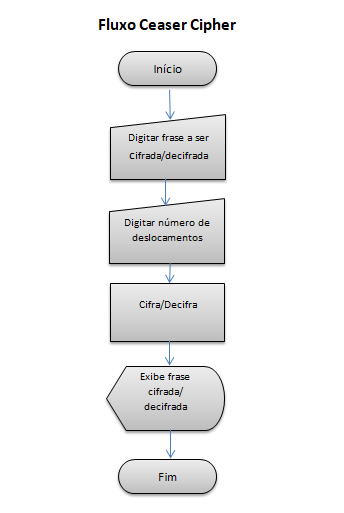

# Cifra de César

## DESCRIÇÃO:

O Ceasar Cipher é um programa Web escrito em Java Script puro. O programa oferece o recurso de criptografar e descriptografar mensagens para que o usuário possa enviar mensagens codificadas de forma que apenas o  destinatário das mensagens possa ler o conteúdo através de uma chave previamente informada pelo emissor da mensagem.

## FLUXOGRAMA

