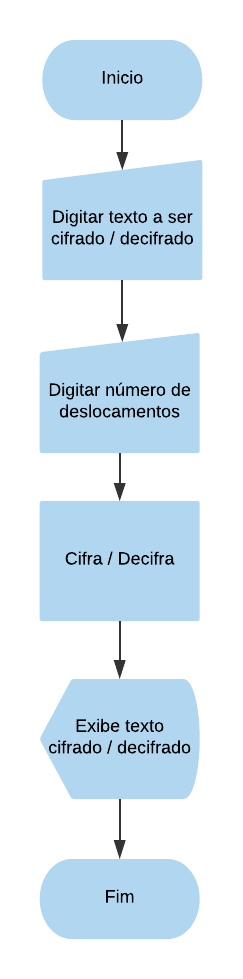

# Cifra de César

## DESCRIÇÃO:

O Ceasar Cipher é um programa Web escrito em Java Script puro. O programa oferece o recurso de criptografar e descriptografar mensagens para que o usuário possa enviar mensagens codificadas de forma que apenas o  destinatário das mensagens possa ler o conteúdo através de uma chave previamente informada pelo emissor da mensagem.

## DIAGRAMA DE BLOCOS



## Introdução

A [cifra de César](https://pt.wikipedia.org/wiki/Cifra_de_C%C3%A9sar) é um dos
primeiros tipos de criptografias conhecidos na história. É um tipo de cifra por
substituição, em que uma letra no texto original é substituída por outra,
seguindo um número fixo para essa subtituição.


O imperador Júlio César usou essa cifra para enviar ordens aos seus generais no
campo de batalha. Essa é uma das técnicas mais simples e mais usadas para
cifrar mensagens.

Por exemplo se usarmos o deslocamento de 3:

* Alfabeto sem cifrar: A B C D E F G H I J K L M N O P Q R S T U V W X Y Z
* Alfabeto com cifra:  D E F G H I J K L M N O P Q R S T U V W X Y Z A B C

Atualmente todas as cifras de substituição alfabética simples, são descifradas
com facilidade e não oferecem muita segurança na comunição, mas a cifra de
César muitas vezes pode fazer parte de um sistema mais complexo de
criptografia, como a cifra de Vigenère, e tem aplicação no sistema ROT13.

## Objetivos

O objetivo deste projeto foi construir uma aplicação web em  JavaScript puro. 

## Considerações gerais

A lógica do projeto foi implementada inteiramente em JavaScript(ES6).
Nesse projeto não foram utilizadas bibliotecas ou frameworks, só
[vanilla JavaScript](https://medium.com/laboratoria-how-to/vanillajs-vs-jquery-31e623bbd46e).

## Estrutura de arquivos


```text
./
├── .gitignore
|__ fluxograma
├── README.md
├── src
│   ├── cipher.js
|___|__ imgBack,jpg
│   ├── index.html
│   ├── tests.js
│   └── style.css
```


### UI

A interface permite ao usuário:

* eleger um `offset` indicando quantas posições de deslocamento de caracteres quer que a cifra utilize
* inserir uma mensagem (letras maiúsculas e minúsculas) deseja cifrar
* ver o resultado da mensagem cifrada
* inserir uma mensagem (letras maiúsculas e minúsculas) para ser decifrada
* ver o resultado da mensagem decifrada

### Scripts / Arquivos

* `src/index.html`:  Este arquivo contem o HTML, CSS e JavaScript.
* `src/cipher.js`: aqui está implementado o cipher, o qual contem duas funções:
    - `encode(key, text)`: `key` é o número de posições que
    queremos mover para a direita no alfabeto e `text` a mensagem (texto)
    que quemos cifrar.
    - ` decode(key, text)`: `key` é o número de posições que
    queremos mover para a esquerda no alfabeto e `text` é a mensagem (texto)
    que queremos decifrar.
* `src/tests.js`: este arquivo contém testes que certificam que as funções encode e decode estão funcionando.


